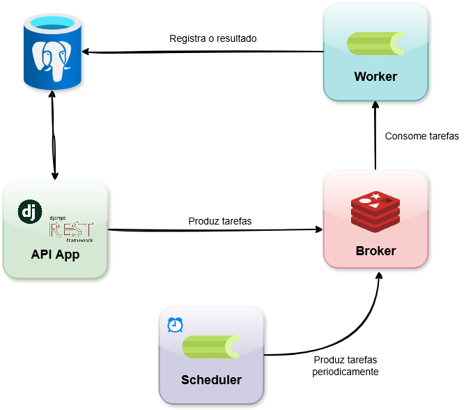

# 🚗 Marketplace de Peças Automotivas (Backend) 

Este é o backend para o sistema de marketplace de peças automotivas, construído com Django Rest Framework, Celery e Docker.

## Principais Tecnologias

- Backend: Django & Django Rest Framework (DRF)

- Banco de Dados: PostgreSQL

- Tarefas Assíncronas/Agendadas: Celery

- Fila de Mensagens (Broker): Redis

- Ambiente: Docker & Docker Compose

## Arquitetura


## 1. Configuração e Execução do Ambiente

O projeto é totalmente containerizado, facilitando a configuração.

### Pré-requisitos

- Docker (https://www.docker.com/get-started)

- Docker Compose

### Passos para Configuração

1. Clone o Repositório

    ```bash
    git clone https://github.com/mariamandafm/desafio-backend-django.git

    cd desafio-backend-django
    ```

2. Crie o Arquivo variáveis de ambiente (`.env`) na raiz do projeto

    Conteúdo do `.env`:
    ```
    DB_HOST=db
    POSTGRES_DB=devdb
    POSTGRES_USER=devuser
    POSTGRES_PASSWORD=changeme
    ```
3. Suba os contêineres
    ```
    docker compose up --build
    ```

    Serão iniciados 5 serviços:

    - `app`: O servidor Django (porta 8000)

    - `db`: O banco de dados PostgreSQL

    - `redis`: O broker de mensagens

    - `celery_worker`: O "trabalhador" que executa tarefas assíncronas

    - `celery_beat`: O "agendador" que dispara tarefas agendadas (cronjobs)


Após a execução, o servidor estará disponível em http://localhost:8000/.

4.  Crie um Superusuário (Opcional)
    ```bash
    docker compose exec app python manage.py createsuperuser
    ```


## 2. Executando as Tarefas Assíncronas

Os serviços de tarefas do Celery (`celery_worker` e `celery_beat`) são **iniciados e executados automaticamente pelo `docker-compose up`**.
- Inicia o worker
    ```bash
    docker compose exec app celery -A app worker -l info
    ```
- Inicia o scheduler
    ```bash
    docker compose exec app celery -A app beat -l info
    ```


### a. Upload de Planilha (Tarefa Assíncrona)

Esta tarefa é disparada através da API e pode ser testada com o arquivo `mock_pecas.csv` presente nesse diretório.

1. Endpoint: `POST /api/inventory/auto-parts/upload-csv/`
2. Autenticação: Requer token de Admin (JWT).
3. Formato: `multipart/form-data`
4. Campo: `file`


### b. Reposição de Estoque (Tarefa Agendada)

Esta tarefa é um "cronjob" gerenciado pelo `celery_beat`. Ela é executada automaticamente todos os dias às 1:00 da manhã.

## 3. Rodando os Testes

Para garantir a integridade do código, execute os testes unitários. O comando executa os testes dentro do contêiner app:
```bash
docker compose exec app python manage.py test
```

## 4. Implementações adicionais
### a. Pipeline de CI (GitHub Actions)
O repositório possui um pipeline de CI configurado em `.github/workflows/`. Este workflow é disparado automaticamente a cada push request para a branch principal.

Etapas:
- Executa o Flake8 para verificar a qualidade do código.

- Executa os testes unitários (`python manage.py test`).

Isso garante que novas alterações não quebrem a funcionalidade existente e mantenham o padrão de código.

### b. Documentação da API (Swagger)

O projeto utiliza `drf-spectacular` para gerar automaticamente a documentação da API (Swagger UI). Isso permite visualizar e testar todos os endpoints disponíveis diretamente pelo navegador.

Após iniciar o ambiente (com `docker compose up`), acesse os seguintes links:

- Swagger UI (Interface Gráfica): http://localhost:8000/api/docs/

    - Esta é a interface visual e interativa para explorar a API.

- Schema (Arquivo de Definição): http://localhost:8000/api/schema/

    - Este é o arquivo schema.yaml que define a estrutura da API, usado pelo Swagger.